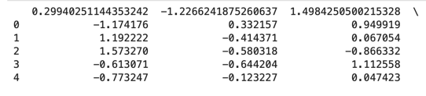
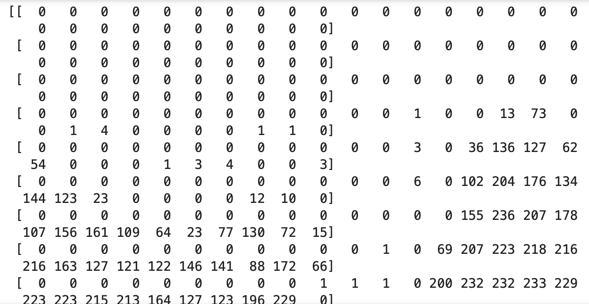
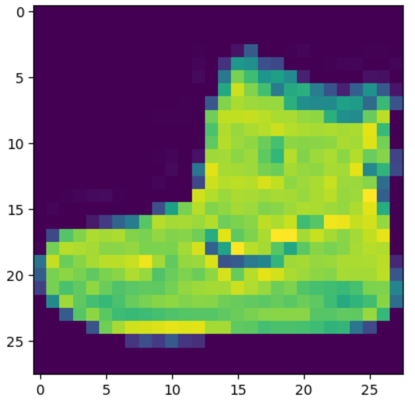

# 2장 개념정리


## 정형 데이터와 비정형 데이터?

| 정형 데이터와 비정형 데이터 |                                              | 이미지   |
|-----------------|----------------------------------------------|-------|
| 정형 데이터          | 테이블 형태의 데이터를 말한다.                            ||
| 비정형 데이터         | 이미지, 소리, 텍스트와 같이 태생적으로 열로 구성할 수 없는 데이터를 말한다. ||

## 심층 신경망

| 심층 신경망 사용해보기 |          |
|--------------|----------|
| 데이터 세트       | CIFAR-10 |

- 데이터 세트 적재
```
import numpy as np
from keras.utils import to_categorical
from keras.datasets import cifar10

(x_train, y_train), (x_test, y_test) = cifar10.load_data()

NUM_CLASS = 10

x_train = x_train.astype('float32') / 255.0
x_test = x_test.astype('float32') / 255.0

y_train = to_categorical(y_train, NUM_CLASS)
y_test = to_categorical(y_test, NUM_CLASS)
```
- 모델 학습
```
from keras.models import Sequential
from keras.layers import Flatten, Dense

model = Sequential(
    [
        Dense(200, activation='relu', input_shape=(32,32,3)),
        Flatten(),
        Dense(100, activation='relu'),
        Dense(10, activation='softmax')
    ]
)

model.compile(
    loss = 'categorical_crossentropy',
    optimizer = 'adam',
    metrics=['accuracy']
)

history = model.fit(x_train, y_train, batch_size = 32, epochs =10)
```

- 모델 평가
```
model.evaluate(x_test, y_test)
```

- 모델 예측

```commandline
preds = model.predict(x_test)

```

-> 낮은 정확도로 인해 합성곱 신경망 사용하기<br>

그 전에 배치정규화 층과 드롭아웃 층 알아보기
- 신경망을 훈련할 때 대표적으로 어려운 한가지가 가중치를 일정한 범위에 유지해야하는 것이다.
- 값이 커지기 시작하면, 그레이디언트 폭주문제가 생기는 것이다. 따라서 우리는 신경망에 데이터를 주입하기 전에 -1~1 사이의 값으로 스케일링을 해주었다.
- 입력 스케일을 조정했기 때문에 모든 층의 활성화 출력도 비교적 스케일이 안정되리라 기대 할 수 있다. -> 초기에는 맞는 말이다! 하지만 네트워크가 훈련됨에 따라서 가중치 값이 랜덤하게 초깃값과 멀어지기 때문에 이런 가정이 무너지기 시작한다.
- 이런 현상을 공변량 변화라고 함.
- 배치정규화가 이런 문제를 해결해줄 수 있다 -> 어떻게 해결을 해주었나? 
- 배치 정규화층은 배치에 대해 각 입력 채널별로 평균과 표준편차를 계산한 다음 평균을 빼고, 표준편차로 나누어 정규화 시킵니다. 
- 채널별로 학습되는 두 개의 파라미터가 있다. 스케일 파라미터(gamma)와 이동 파라미터(beta)이다. 

- 드롭아웃층?
- 성공적인 머신러닝 알고리즘이 되기 위해서는 이전에 본적 없는 데이터도 잘 맞추어야 한다.
- 드롭아웃층은 훈련 과정에서 이전 층의 유닛 일부를 선ㅌ택하여 출력을 0으로 지정합니다.

```commandline
import tensorflow as tf

input_layer = tf.keras.layers.Input(shape=(32,32,3))
x = tf.keras.layers.Conv2D(
        filters=32,
        kernel_size = (3, 3),
        strides = 1,
        padding = 'same',
)(input_layer)
x = tf.keras.layers.BatchNormalization()(x)
x = tf.keras.layers.LeakyReLU()(x)

x = tf.keras.layers.Conv2D(
        filters=32,
        kernel_size = (3, 3),
        strides = 1,
        padding = 'same',
)(x)
x = tf.keras.layers.BatchNormalization()(x)
x = tf.keras.layers.LeakyReLU()(x)

x = tf.keras.layers.Conv2D(
        filters=32,
        kernel_size = (3, 3),
        strides = 1,
        padding = 'same',
)(x)
x = tf.keras.layers.BatchNormalization()(x)
x = tf.keras.layers.LeakyReLU()(x)

x = tf.keras.layers.Conv2D(
        filters=32,
        kernel_size = (3, 3),
        strides = 1,
        padding = 'same',
)(x)
x = tf.keras.layers.BatchNormalization()(x)
x = tf.keras.layers.LeakyReLU()(x)

x = tf.keras.layers.Flatten()(x)
x = tf.keras.layers.Dense(128)(x)
x= tf.keras.layers.BatchNormalization()(x)
x = tf.keras.layers.LeakyReLU()(x)
x = tf.keras.layers.Dropout(rate = 0.5)(x)

x = Dense(NUM_CLASS, activation='softmax')(x)

model = tf.keras.models.Model(input_layer, x)

model.compile(
    loss = 'categorical_crossentropy',
    optimizer = 'adam',
    metrics=['accuracy']
)
model.fit(x_train, y_train, batch_size = 1000, epochs=10)


```

-> 0.85 , validation x


