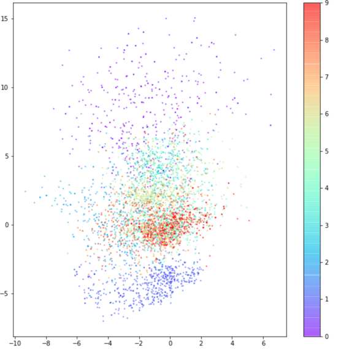

# VAE - 변이형 오토인코더

- 요약정리
1. VAE는 생성모델링에서 가장 기본적이고 널리 알려진 딥러닝 구조 중 하나이다.

# AE-오토인코더

- 인코더 -> 네트워크는 고차원 입력 데이터를 저차원 표현 벡터로 압축합니다.
- 디코더 -> 네트워크는 주어진 표현 벡터를 원본 차원으로 다시 압축 해제합니다.

- 훈련? : 입력과 재구성 사이의 손실을 최소화하는 인코더와 디코더의 가중치를 찾기 위해 네트워크가 훈련된다.
- 표현벡터? : 원본 이미지를 저차원 잠재공간으로 압축한 것 -> 잠재공간에 어떤 부분을 누르면, 디코더로 이미지를 생성할 수 있다.

## 인코더 코드

```
import tensorflow as tf

encoder_input = tf.keras.layers.Input(shape=(32,32,3))

x= encoder_input

conv_layer = tf.keras.layers.Conv2D(
        filters=32,
        kernel_size = (3, 3),
        strides = 1,
        padding='same'
)(x)
x = tf.keras.layers.LeakyReLU()(conv_layer)
conv_layer = tf.keras.layers.Conv2D(
        filters=64,
        kernel_size = (3, 3),
        strides = 2,
        padding='same'
)(x)
x = tf.keras.layers.LeakyReLU()(conv_layer)
conv_layer = tf.keras.layers.Conv2D(
        filters=64,
        kernel_size = (3, 3),
        strides = 2,
        padding='same'
)(x)
x = tf.keras.layers.LeakyReLU()(conv_layer)
conv_layer = tf.keras.layers.Conv2D(
        filters=64,
        kernel_size = (3, 3),
        strides = 1,
        padding='same'
)(x)
x = tf.keras.layers.LeakyReLU()(conv_layer)
x = tf.keras.layers.Flatten()(x)

encoder_output = tf.keras.layers.Dense(2)(x)

encoder = tf.keras.models.Model(encoder_input, encoder_output)


```

## 디코더 코드

```

```

## AE 분석 
- 이미지를 어떻게 잠재공간에 표현하는지? 
- AE의 문제점을 개선한 VAE?
- 입력 이미지를 넣은 인코더의 값을 주목하자. -> 저차원의 벡터로 변환


- 위 그래프에서 흥미로운 점
1. 포인트 (0,0)에 대칭이거나 값이 제한되어 있지 않다.
2. 어떤 숫자는 매우 작은 영역에 밀집되어 있다.
3. 색깔 사이에는 간격이 크고 숫자가 거의 없다.
4. 잠재공간에서 어떤 위치를 찍으면 새로운 이미지 생성함.

-> 문제 해결을 위한 방법?
1. 인코더 -> 제 3자 -> 위치 표시
2. 정규화 하는 것을 말함
```
z = mu(인코더 결과) + sigma(인코더의 정확도) * epsilon(랜덤 값?)
```
