# 머신러닝 프로젝트 처음부터 끝까지

- 이 장에서는 부동산 회사에 막 고용된 데이터 과학자라고 가정하고 예제 프로젝트의 처음부터 끝까지 진행해보기.


## 캘리포니아 주택 가격 데이터를 이용한 문제 해결 요약표

| 캘리포니아 인구조사 데이터 | 주택 가격 모델 만들기                                                        |
|----------------|---------------------------------------------------------------------|
| 현재 시스템         | 구역 주택 가격을 전문가가 수동으로 추정한다.<br/>실제 중간 가격을 구해보면 팀에서 추정한 것이 20% 이상 벗아났음 |
| 원하는 모델         | 구역의 데이터를 기반으로 중간 주택 가격을 예측하는 모델을 훈련시킨다.                             |
| 사용할 모델         |                                                                     |
| 데이터의 형태        | 레이블 된 데이터                                                           |
| 문제의 종류         | 지도 학습( 단변량 다중 회귀 문제 )                                               |
| 성능 지표          | 평균 제곱 오차(RMSE), 오차가 커질 수록 이 값이 커진다.                                 |


## 다음은 진행할 주요 단계이다.

1. 큰 그림을 본다.
2. 데이터를 구한다.
3. 데이터로부터 통찰을 얻기 위해 탐색하고 시각화 한다.
4. 머신러닝 알고리즘을 위해 데이터를 준비한다.
5. 모델을 선택하고 훈련시킨다.
6. 모델을 상세하게 조정한다.
7. 솔루션을 제시한다.
8. 시스템을 론칭하고 모니터링 하고 유지보수 한다.

- 데이터 찾아볼 때 플랫폼 리스트
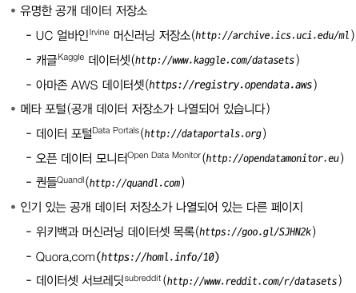

## 이 장에서는 StatLib 저장소에 있는 캘리포니아 주택 가격 데이터 셋을 이용할 것이다.
- 데이터 설명 : 1990년 캘리포니아 인구조사 데이터를 기반으로 한다. 

### 큰 그림 보기
- 캘리포니아 인구조사 데이터를 사용해서 -> 캘리포니아의 주택 가격 모델을 만드는 것이 목적이다!

- 이 데이터는 캘리포니아의 (블록 그룹)마다 인구, 중간 소득, 중간 주택 가격등을 담고 있는 데이터입니다.
  - 블록이란? : 미국 인구조사국에서 샘플 데이터를 발표하는 데 사용하는 최소한의 지리적 단위이다. (하나의 블록 그굽은 보통 600~3000명의 인구를 나타낸다.)

- 이 데이터를 이용해서 모델을 학습시켜, 다른 측정 데이터가 주어졌을 때 구역의 중간 주택 가격을 예측해야 한다.

### 문제 정의 하기
- 제일 먼저 우리가 머리 속에 확립해야 하는 개념은 "비즈니스의 목적이 무엇인지"에 대한 것이다.
- 모델을 만들어 어떤 이익을 얻으려고 하는지 확실히 알아야 합니다.
  - 문제를 확실하게 이해하는 것은 = 어떤 알고리즘을 사용할지? 모델 평가에 어떤 지표를 사용할 지? 모델 튜닝을 위해 얼마나 노력을 투여할지 결정하기 때문에 아주 중요합니다.
- 다음으로 우리는 현재 솔루션이 어떤식으로 구성되어 있는지 알아야 합니다. 
  - 현재는 구역 주택 가격을 전문가가 수동으로 추정한다고 한다! 한 팀이 구역에 관한 최신 정보를 모으고 있는데, 중간 주택 가격을 얻을 수 없을 때는 복잡한 규칙을 사용해 추정을 한다.

### 데이터 구하기 (다운받기)

```python
import os
import tarfile
import urllib

DOWNLOAD_ROOT = "https://raw.githubusercontent.com/ageron/handson-ml2/master/"
HOUSING_PATH = os.path.join('datasets', 'housing')
HOUSING_URL = DOWNLOAD_ROOT + 'datasets/housing/housing.tgz'

def fetch_housing_data(housing_url=HOUSING_URL, housing_path = HOUSING_PATH):
    os.makedirs(housing_path, exist_ok=True)
    tgz_path = os.path.join(housing_path, 'housing.tgz')
    urllib.request.urlretrieve(housing_url, tgz_path)
    housing_tgz = tarfile.open(tgz_path)
    housing_tgz.extractall(path=housing_path)
    housing_tgz.close()

fetch_housing_data()
```
- 위 코드를 실행시키면 다음과 같이 폴더에 csv 파일이 다운로드 받아집니다.
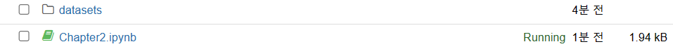

### 데이터 통찰을 위해 탐색하고, 시각화 하기

- pandas 라이브러리를 이용하기.

```python
import pandas as pd

def load_housing_data(housing_path=HOUSING_PATH):
    csv_path = os.path.join(housing_path, "housing.csv")
    return pd.read_csv(csv_path)
```

- head() 함수를 이용해 5개의 행을 확인해보자.
- 
```python
housing = load_housing_data()
housing.head()
```
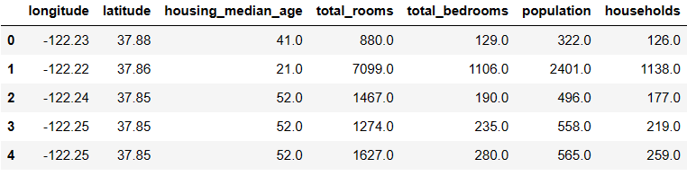
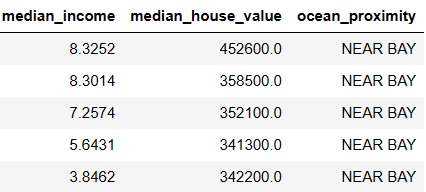
- 사진을 보면, 특성이 왼쪽부터 차례대로 총 10개가 나와 있다.

| 특성                 | 한국 뜻       |
|--------------------|------------|
| longitude          | 경도         |
| latitude           | 위도         |
| house_median_age   | 가정 집 평군 나이 |
| total_rooms        |            |
| total_bedrooms     |            |
| population         |            |
| households         |            |
| median_income      |            |
| median_house_value |            |
| ocean_proximity    |            |

- info() 함수를 이용해 각 특성에 대한 정보를 확인해보자.

```python
housing.info()
```

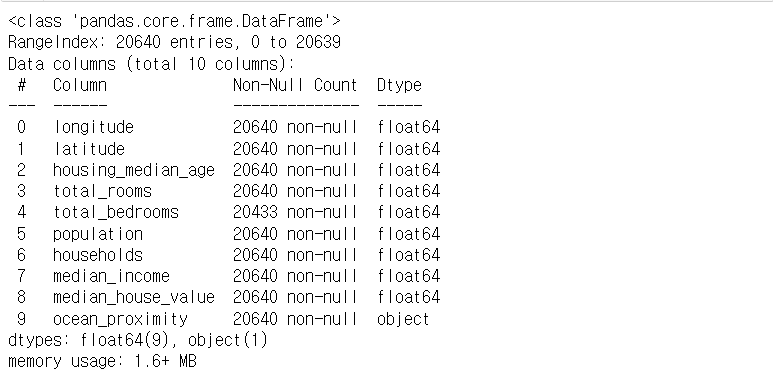
- 그림을 보시면, 각 특성에 대한 데이터 타입, 널 값이 아닌 행의 개수가 나와 있음.
  - object 데이터 타입은 , 범주형으로 확인이 된다. 따라서 다음 코드를 이용해 그 개수를 확인하자.
```python
housing['ocean_proximity'].value_counts()
```
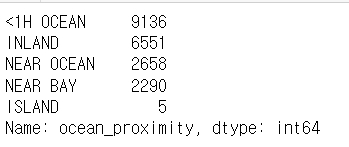

- descirbe() 함수를 이용해, 숫자형 데이터 타입에 대한 기본 통계 정보를 확인하자.

```python
housing.describe()
```
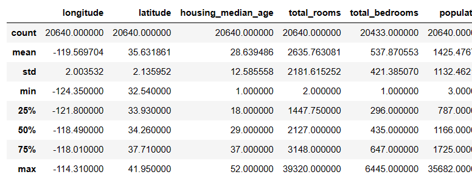
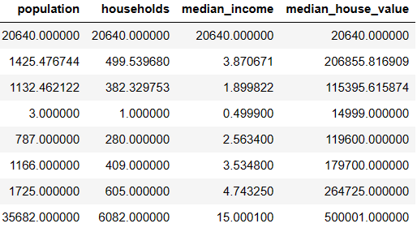

- matplotlib 라이브러리를 이용해 데이터를 시각화하자!
  - 데이터 시각화를 통해 데이터의 형태를 빠르게 알 수 있다.

- 히스토그램을 이용해 수치형 데이터를 시각화.
```python
#matplotlib inline
import matplotlib.pyplot as plt

housing.hist(bins=100, figsize=(20,15))
plt.show()
```
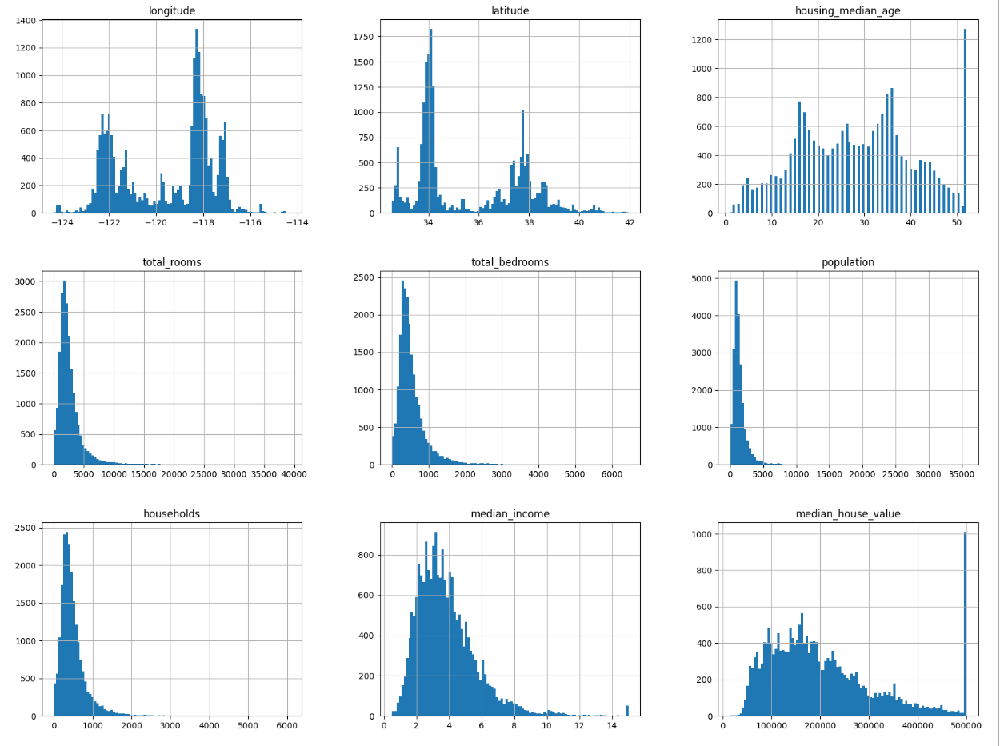
- y절편이 사람 수
- x 절편이 각 특성에 대한 값
- ex) 중간 소득의 경우 x절편이 소득이 몇만 달러인지? y절편이 인구수
- 시각화를 통해 얻을 수 있는 인사이트
  1. 이상치 확인
  2. 특성들의 스케일이 다름

## 데이터 스누핑 현상을 막기 위해, 미리 테스트 데이터 세트를 분할 해야한다.
- 계층적 샘플링을 통한 테스트 세트 분할!
- 어떤 것을 기반으로? -> 소득 카테고리를 기반으로 분할
```python
housing['income_cat'] = pd.cut(housing['median_income'], bins=[0. , 1.5, 3.0, 4.5, 6., np.inf], labels=[1,2,3,4,5])
housing['income_cat'].hist()
```
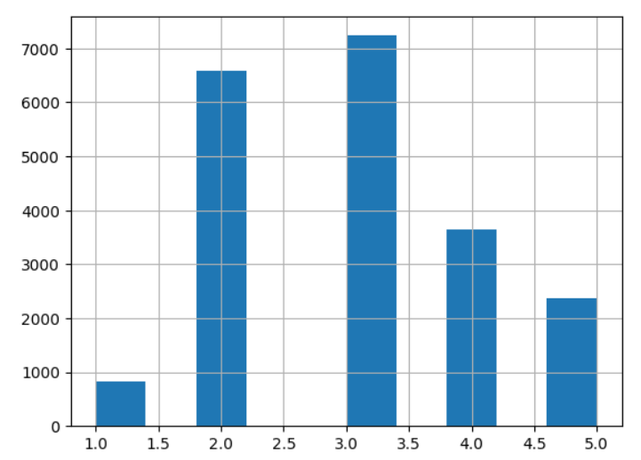
위 그림에서 볼 수 있는 것처럼 해당 주간 소득 데이터를 기반으로 나머지 특성 데이터를 계층적 분할 한다.

```python
from sklearn.model_selection import StratifiedShuffleSplit

split = StratifiedShuffleSplit(n_splits=1, test_size=0.2, random_state=42)
for train_index, test_index in split.split(housing, housing['income_cat']):
    strat_train_set = housing.loc[train_index]
    strat_test_set = housing.loc[test_index]
```

```python
for set_ in (strat_train_set, strat_test_set):
    set_.drop("income_cat", axis=1, inplace=True)
```

- 테스트 데이터 세트를 분할 했으니, 이제 다시 데이터 시각화를 이어 가보자.
- 지리적 데이터 시각화
```python
housing.plot(kind='scatter', x='longitude', y='latitude')
```
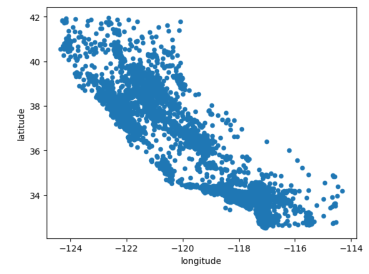

```python
housing.plot(kind='scatter', x='longitude', y='latitude', alpha=0.1)
```
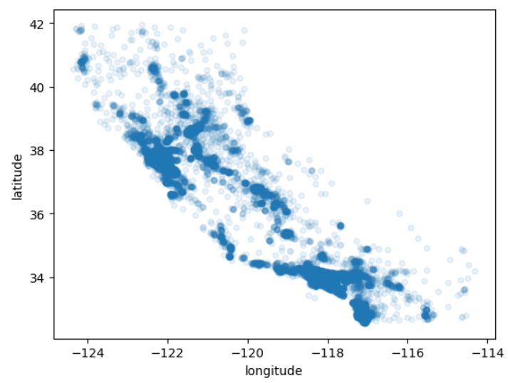

```python
housing.plot(kind='scatter', x='longitude', y='latitude', alpha=0.4,
            s= housing['population']/100, label="population", figsize=(10, 7), 
            c='median_house_value', cmap=plt.get_cmap('jet'), colorbar=True, sharex=False)
plt.legend()
```
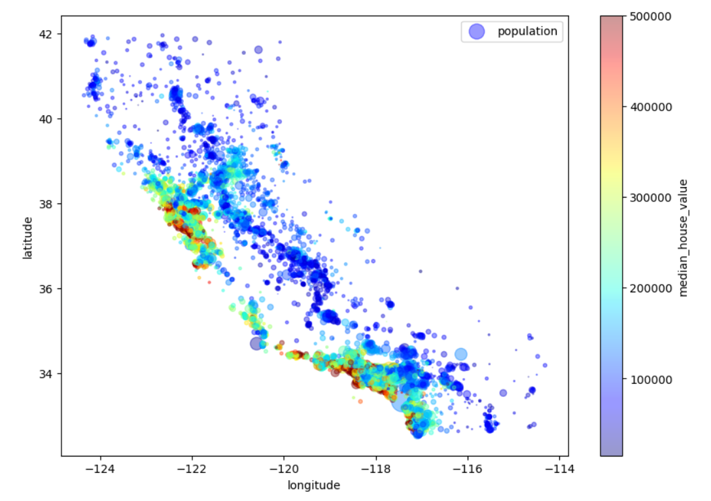

- 상관관계 조사하기

```python
corr_matrix = housing.corr()
corr_matrix['median_house_value'].sort_values(ascending=False)
```
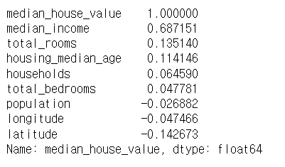

### 머신러닝 알고리즘을 위한 데이터 준비!!
- 머신러닝 알고리즘을 위해 데이터를 준비할 차례이다.
- 이 작업을 수동으로 하는 대신 함수를 만들어 자동화해야 하는 이유가 있다.
  - 어떤 데이터셋에 대해서도 데이터 변환을 손쉽게 반복할 수 있다. 예를 들어 다음번에 새로운 데이터 셋을 사용할 때
  - 향후 프로젝트에 사용할 수 있는 변환 라이브러리를 점진적으로 구축하게 됩니다.
  - 실제 시스템에서 알고리즘에 새 데이터를 주입하기 전에 변환시키는데 이 함수를 사용할 수 있습니다.
  - 여러 가지 데이터 변환을 쉽게 시도해 볼 수 있고, 어떤 조합이 가장 좋은지 확인하는 데 편리합니다.

```python
housing = strat_train_set.drop('median_house_value', axis=1)
housing_labels = strat_train_set['median_house_value'].copy()
```
### 데이터 정제하기

- 누락된 값 채우기
```python
from sklearn.impute import SimpleImputer

imputer = SimpleImputer(strategy="median")

housing_num = housing.drop('ocean_proximity', axis=1)
imputer.fit(housing_num)
imputer.statistics_

```
```python
housing_num.median().values

X = imputer.transform(housing_num)
housing_tr = pd.DataFrame(X, columns=housing_num.columns, index = housing_num.index)
```
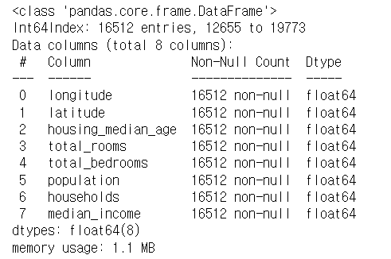
그림을 보면 누락된 값이 채워진 것을 볼 수 있다.

- 범주형 데이터 다루기
```python
housing_cat = housing[['ocean_proximity']]
housing_cat.head(10)
```
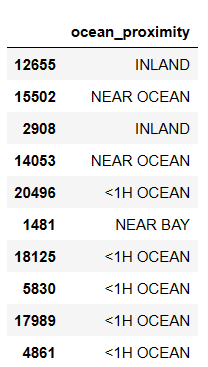
- OrdinalEncoder를 사용해 문자를 -> 수치형으로 변환
```
from sklearn.preprocessing import OrdinalEncoder

ordinal_encoder = OrdinalEncoder()
housing_cat_encoded = ordinal_encoder.fit_transform(housing_cat)
housing_cat_encoded[:10]
```
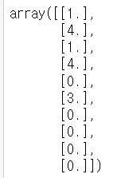
```python
ordinal_encoder.categories_
```
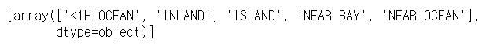
- OneHotEncoder를 사용해 -> 수치형 데이터를 배열로 만들기
```python
from sklearn.preprocessing import OneHotEncoder

cat_encoder = OneHotEncoder()
housing_cat_1hot = cat_encoder.fit_transform(housing_cat)

housing_cat_1hot.toarray()
```
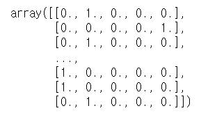

- 나만의 변환기 만들기
- 사이킷런은 덕 타이핑을 지원하므로 fit(), transform(), fit_transform() 메서드를 구현한 파이썬 클래스를 만들면 된다.
- 마지막 메서드는 TransformerMixin을 상속하면 자동으로 생성된다.
- BaseEstimator를 상속하면, 하이퍼파라미터 튜닝에 필요한 두 메서드 get_parmas(), set_params() 추가로 얻게된다.

```python
from sklearn.base import BaseEstimator, TransformerMixin

# column index
rooms_ix, bedrooms_ix, population_ix, households_ix = 3, 4, 5, 6

class CombinedAttributesAdder(BaseEstimator, TransformerMixin):
    def __init__(self, add_bedrooms_per_room=True): # no *args or **kargs
        self.add_bedrooms_per_room = add_bedrooms_per_room
    def fit(self, X, y=None):
        return self  # nothing else to do
    def transform(self, X):
        rooms_per_household = X[:, rooms_ix] / X[:, households_ix]
        population_per_household = X[:, population_ix] / X[:, households_ix]
        if self.add_bedrooms_per_room:
            bedrooms_per_room = X[:, bedrooms_ix] / X[:, rooms_ix]
            return np.c_[X, rooms_per_household, population_per_household,
                         bedrooms_per_room]
        else:
            return np.c_[X, rooms_per_household, population_per_household]

attr_adder = CombinedAttributesAdder(add_bedrooms_per_room=False)
housing_extra_attribs = attr_adder.transform(housing.values) 
```
- 특성 스케일링 하기
- 몇 가지를 제외하고, 머신러닝 알고리즘은 입력 숫자 특성들의 스케일이 많이 다르면 잘 작동하지 않습니다.
- 모든 특성의 범위를 같도록 만들어주는 방법으로 min-max 스케일링과 표준화가 널리 사용된다.
- 사이킷런에서는 이에 해당하는 MinMaxScaler변환기를 제공합니다.
- 0~1사이를 원하지 않는다면, feature_range 매개변수로 범위를 변경할 수 있습니다.
- 표준화의 경우에는 StandardScaler 변환기를 사용한다.
  - 변환 파이프 라인 사용하기


```python
from sklearn.pipeline import Pipeline
from sklearn.preprocessing import StandardScaler

num_pipeline = Pipeline([
    ('imputer', SimpleImputer(strategy='median')),
    ('attribs_adder', CombinedAttributesAdder()),
    ('std_scaler', StandardScaler()),
])

housing_num_tr = num_pipeline.fit_transform(housing_num)
```
- Pipeline은 연속된 단계를 나타내는 이름/추정기 쌍의 목록을 입력으로 받습니다.
- 마지막 단계에는 변환기와 추정기를 모두 사용가능, 그 외에는 모두 변환기여야 합니다.
- 즉, fit_transform() 메서드를 갖고 있어야 합니다.

```python
from sklearn.compose import ColumnTransformer

num_attribs = list(housing_num)
cat_attribs = ['ocean_proximity']

full_pipeline = ColumnTransformer([
    ('num', num_pipeline, num_attribs),
    ('cat', OneHotEncoder(), cat_attribs),
])

housing_prepared = full_pipeline.fit_transform(housing)
```
-> 범주형 데이터와 수치형 데이터를 둘 다 같이 다룰 수 있음.

### 모델 선택과 훈련!

- 선형 회귀 모델 만들고, 훈련 시키기
```python
from sklearn.linear_model import LinearRegression

lin_reg = LinearRegression()
lin_reg.fit(housing_prepared, housing_labels)
```
- 몇개의 데이터에 테스트 하기
```python
some_data = housing.iloc[:5]
some_labels = housing_labels.iloc[:5]
some_data_prepared = full_pipeline.transform(some_data)

print('예측: ', lin_reg.predict(some_data_prepared))
print('레이블: ', list(some_labels))
```
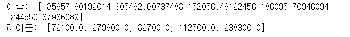

- RMSE 측정하기
```python
from sklearn.metrics import mean_squared_error
housing_predictions = lin_reg.predict(housing_prepared)
lin_mse = mean_squared_error(housing_labels, housing_predictions)
lin_rmse = np.sqrt(lin_mse)
lin_rmse
```
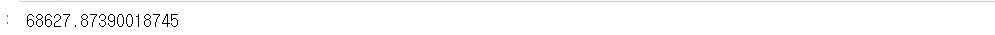

- 결정 트리 모델 만들기!
```python

from sklearn.tree import DecisionTreeRegressor

tree_reg = DecisionTreeRegressor()
tree_reg.fit(housing_prepared, housing_labels)
```

- 트리모델에 대한 RMSE 계산하기
```python
housing_predictions = tree_reg.predict(housing_prepared)
tree_mse = mean_squared_error(housing_labels, housing_predictions)
tree_rmse = np.sqrt(tree_mse)
tree_rmse
```
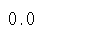

- 교차 검증을 사용한 평가하기
- k-겹 교차 검증 기능을 사용해, 평가하기
- 훈련세트를 폴드라 불리는 10개의 서브셋으로 무작위로 분할한다.
```python
from sklearn.model_selection import cross_val_score

scores = cross_val_score(tree_reg, housing_prepared, housing_labels, scoring='neg_mean_squared_error', cv=10)
tree_rmse_scores = np.sqrt(-scores)

def display_scores(scores):
    print('점수: ', scores)
    print('평균: ', scores.mean())
    print('표준편차: ', scores.std())
    
display_scores(tree_rmse_scores)
```

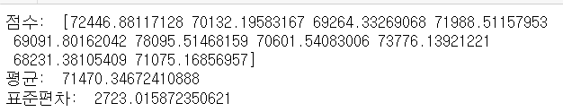

## 모델 세부 튜닝 하기!

- 그리드 탐색 해보기
```python
from sklearn.model_selection import GridSearchCV
from sklearn.ensemble import RandomForestRegressor

param_grid = [
    {'n_estimators' : [3, 10, 30], 'max_features' : [2,4,6,8]},
    {'bootstrap' : [False], 'n_estimators' : [3, 10], 'max_features' : [2,3,4]}
]

forest_reg = RandomForestRegressor()

grid_search = GridSearchCV(
    forest_reg,
    param_grid,
    cv = 5,
    scoring='neg_mean_squared_error',
    return_train_score=True
)

grid_search.fit(housing_prepared, housing_labels)
```

```python
cvres = grid_search.cv_results_
for mean_score, params in zip(cvres['mean_test_score'], cvres['params']):
    print(np.sqrt(-mean_score), params)
```
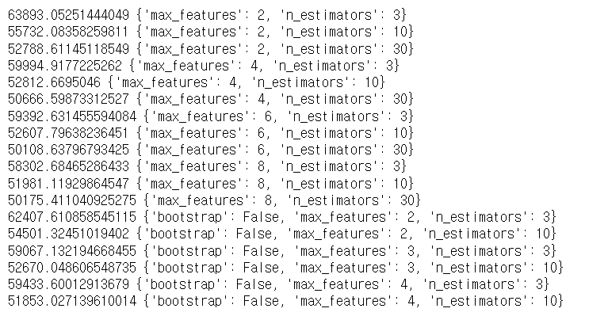

- 랜덤 그리드 탐색 해보기
```python

```


### 연습문제 풀어보기!

1. 서포트 벡터 머신 회귀(sklearn.svm.SVR)를 kernel='linear' (하이퍼파라미터 C를 바꿔가며)나 kernel = 'rbf'(하이퍼파라미터 C와 gamma를 바꿔가며) 등의 다양한 하이퍼파라미터 설정으로 시도해보세요. 지금은 이 하이퍼파라미터가 무엇을 의미하는지 너무 신경 쓰지 마세요. 최상의 SVR 모델은 무엇인가요?

```python
from sklearn.model_selection import GridSearchCV
from sklearn.ensemble import RandomForestRegressor

param_grid = [
    {'kernel': ['linear'], 'C': [10., 30., 100., 300., 1000., 3000., 10000., 30000.0]},
    {'kernel': ['rbf'], 'C': [1.0, 3.0, 10., 30., 100., 300., 1000.0],
    'gamma': [0.01, 0.03, 0.1, 0.3, 1.0, 3.0]},
]

grid_search = GridSearchCV(
    svr_reg,
    param_grid,
    cv = 5,
    scoring='neg_mean_squared_error',
    return_train_score=True,
    verbose=2
)

grid_search.fit(housing_prepared, housing_labels)
```

2. GridSearchCV를 RandomizedSearchDV로 바꿔보세요.
```python
from sklearn.model_selection import RandomizedSearchCV

param_grid = [
    {'kernel': ['linear'], 'C': [10., 30., 100., 300., 1000., 3000., 10000., 30000.0]},
    {'kernel': ['rbf'], 'C': [1.0, 3.0, 10., 30., 100., 300., 1000.0],
    'gamma': [0.01, 0.03, 0.1, 0.3, 1.0, 3.0]},
]

ranS = RandomizedSearchCV(
    svm_reg, param_distributions=param_distribs,
    n_iter=50, cv=5, scoring='neg_mean_squared_error',
    verbose=2, random_state=42
)

ranS.fit(housing_prepared, housing_labels)

```

3. 가장 중요한 특성을 선택하는 변환기를 준비 파이프라인에 추가해보세요.
```python

```