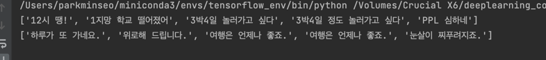
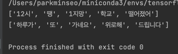
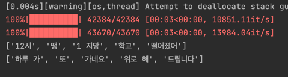

# 시퀀스 투 시퀀스 모델

## 데이터 
- Chatbot data
- 한국어 챗봇 학습을 목적으로 사용
- https://github.com/songys/Chatbot_data

## 데이터 분석하기

1. 음절, 어절(단어), 형태소 단위로 나눠 문장의 길이를 측정한다.
분석 이유 : 나중에 모델의 입력 뉴런의 개수가 될 것이다.

## 데이터 전처리 과정

| 전처리 과정    | 결과 데이터                  |
|-----------|-------------------------|
| 데이터 불러오기  |  |
| 데이터 토크나이징 |  |
| 형태소 분석 함수 |                         |
| 단어 사전 만들기 ||

