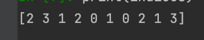

# 코드 이해 안될 떄 보려고 만든 파일

| 코드                                            | 실행결과 |
|-----------------------------------------------|------|
| indices = np.random.choice(range(len(x)), 10) |      |
| fig = plt.figure(figsize=(15,3))              ||


## 간편 코드
```
import matplotlib.pyplot as plt

n_to_show = 10
indices = np.random.choice(range(len(x_test)), n_to_show)

fig = plt.figure(figsize=(15, 3))
fig.subplots_adjust(hspace=0.4, wspace=0.4)

for i, idx in enumerate(indices):
    img = x_test[idx]
    ax = fig.add_subplot(1, n_to_show, i+1)
    ax.axis('off')
    ax.text(0.5, -0.35, ' pred = ' + str(preds_single[idx]), fontsize=10, ha='center', transform=ax.transAxes)
    ax.text(0.5, -0.7, ' act = ' + str(actual_single[idx]), fontsize=10, ha='center', transform=ax.transAxes)
    ax.imshow(img)
plt.show()
```
-> 실행 결과 
