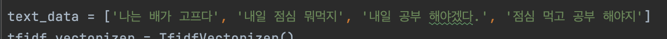
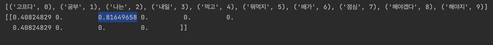

# 사이킷런을 이용해 특징 추출 하기

| 텍스트 데이터 수치화 방법    | 코드                       |
|-------------------|--------------------------|
| CountVectorizer   | 특징추출(countvectorizer) 참조 |
| TfidVectorizer    | 특징추출(tfidvectorizer) 참조  |
| HashingVectorizer |                          |

## CountVectorizer 그림 설명

## TfidVectorizer 그림 설명

### TF-IDF 용어설명
| 용어                              | 설명                                                    |
|---------------------------------|-------------------------------------------------------|
| TF, Term Frequency              | 하나의 데이터 속에 특정 단어가 등장하는 횟수                             |
| DF, Document Frequency          | 여러 데이터 속에 특정 단어가 등장하는 횟수                              |
| IDF, Inverse  Document Frequency | 다른 데이터에 특정 단어가 등장하지 않을 수록 값이 커짐                       |
| TF-IDF                          | 해당 문서에 특정 단어가 많이 등장하지만, 다른 문서에는 많이 없는 단어 일수록 높은 값을 갖음 |

- 결과로 나온 벡터는 TF-IDF의 값으로 "나는"이라는 단어는 다른 문장에서 나오지 않고, 해당 문장에 많이 등장 하므로, 높은 값을 갖는 것을 볼 수 있다.
